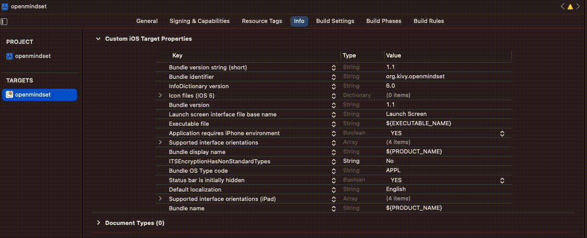

# Build iOS
Key notes for these build instructions:
- toolchain (kivy-ios): is active with the python venv is active AND your are in the direcotry that it is installed in.
- These instructions are based on building on arm64 architecture. However, I do not think there is a difference if x86_64 arch is used (as of October 2023). In the past there have been differences.

## Current iOS TestFlight version
For those interested in seeing the latest version you can download it now to your iPhone.
1. [Download](https://testflight.apple.com/join/1gCPBjbZ) iOS TestFlight app.
2. Download Open Mindset iOS from TestFlight app. 
    - The link above will both download TestFlight to your iOS device and then provide the option to download the latest Open Mindset version for testing on your iPhone.


## Step 1: Create and activate venv
This step is the same as [create venv in README](../README.md#create-venv), however this version names the Python Virtual Environment 'mindset' only to help .
```
 python -m venv venv
 . venv/bin/activate
```
Once mindset (or venv) is activated the environment is set to the terminal regardless of the directory your are in.

```
 python -m pip install pip-tools
 pip-compile requirements.in
```
```
pip-sync
```


## Step 2: kivy-ios
Install kivy-ios to pip environment:
```
pip install kivy-ios
```

## Step 3: Create toolchain environment
After adding kivy-ios to your venv, create another diretory that will store the Xcode builds from the toolchain software package.

Navigate into KivyBuilds (name of directory I am using to store Xcode project and the toolchain environment).

A file structure I use for this work is
```
_environments/
    venv/
KivyBuilds/
    # toolchain environment will go here
poc-mobil-python/
```


From inside KivyBuilds/ create the toolchain environemnt
```
toolchain build python3 kivy pillow libffi ffpyplayer 
```
This takes about 20 minutes with a good internet connection.

```
toolchain pip install kivymd kaki watchdog event_bus 
```

### Key Note on toolchain environment
toolchain commands are particular to the folder where toolchain packages are installed. The gif below demonstrates how your toolchain environment works. Once inside the folder where Step 3 is executed (i.e. KivyBuilds in the file structure example), if you do `toolchain status` you will see all the packages installed. However, if you naviagate outside of that folder toolchain status will return no install pacakges.

 

** note the gif shows the name of the Python Virtual Environment (aka venv) as "mindset03"

### Background on toolchain/ kivy-ios
toolchain is both the (1) command and (2) pacakge/suite/collection of software availible in kivy-ios package. toolchain suite of software will convert the python project (poc-mobile-python) to an Xcode project.

## Step 4: Create Xcode project
Again from inside your KivyBuilds/ do the following command:
```
toolchain create openmindset ~/Documents/poc-mobile-python
```
Here openmindset could be anything and the last argument is the path to the Python Kivy project.

## Step 5: Signin to Xcode

Sign in with your [Apple Developer account](https://developer.apple.com/programs/)
 

## Step 6: Build to simulator or iPhone
Select device and press the play button

## Key Xcode Steps Needed to put Openmindset on TestFlight
Prior to sending your application to the Apple App Store. The app must get sent to Apple's App Store Connects where it will get submitted into TestFlight. TestFlight is the testing phase of the app. There are checks and requirements your Xcode project will have to pass for TestFlight to accept the application. Here are some key items needed for Open Mindset:
1. info.plist, add key `NSCameraUsageDescription` and custom explaination for user. The app currently uses: "Allow Open Mindset to receive images from the AI."
 
2. info.plist, add key `ITSEncryptionHasNonStandardTypes` and value "No".
    - This is not necessary but it you will be asked about encryption types in App Store Connects. As the app stands there is no non-standard encryption.
    - https://developer.apple.com/documentation/security/complying_with_encryption_export_regulations

3. Add images Resources > AppIcon
    - Select iOS All Sizes
    - It is necessary to include iOS 76pt (152x152 pixels), iOS 83.5pt (167x167 pixels), and iOS 1,025pt (1024x1024 pixels)
## Build to TestFlight
1. Set up info.plist camera 
2. From inside Xcode select Product menu > Archive
    - This creates a file that will be submitted to App Store Connects
3. After Archive (.xcarchive file) is created select the file from Oragnizer and click "Distribute App".
    - This can also be accessed by Window menu > Organizer
4. There will be a automated process of verifying the package meets Apple requirements
    - one issue we have had is a binary that is not accepted from the toolchain environment. The remedy to this is just delete the file and the package will get accepted.
        - File to delete: KivyBuilds/dist/root/python3/lib/python3.10/site-packages/_watchdow_fsevents.cpython-310-darwin.so

## Problems Encountered with Building

### 1. ModuleNotFoundError: No module named 'kivy.core.window._window_sdl2
If encountering `ModuleNotFoundError: No module named 'kivy.core.window._window_sdl2'`
Make sure Homebrew environment has 
```
brew "sdl2"
brew "sdl2_image"
brew "sdl2_mixer"
brew "sdl2_ttf"
```
Then, if these are installed, try `brew upgrade`.

### 2. Xcode returning an error that a python venv module is missing.
The most common is that the toolchain environment needs to have the package installed. So one will do either `toolchain build` or `toolchain pip install`.

However, if the package is installed in the global python pip enviornment this could throw off the toolchain installation. Therefore, if certain the module has been installed
- check the location of installation in the terminal after your `toolchain build ...` or `toolchain pip install ...`
- Check `pip list` from your global pip and see if the package is there.

If the package is in the global environment: uninstall from global environment and reinstall to the toolchain environment.

## Building with Kivy==2.2.1
These instructions are directing to build from the Kivy Master github branch. However, it is possible to build this project with Kivy==2.2.1. Doing this also requires one to install pygame==2.5.2 to the Python venv.